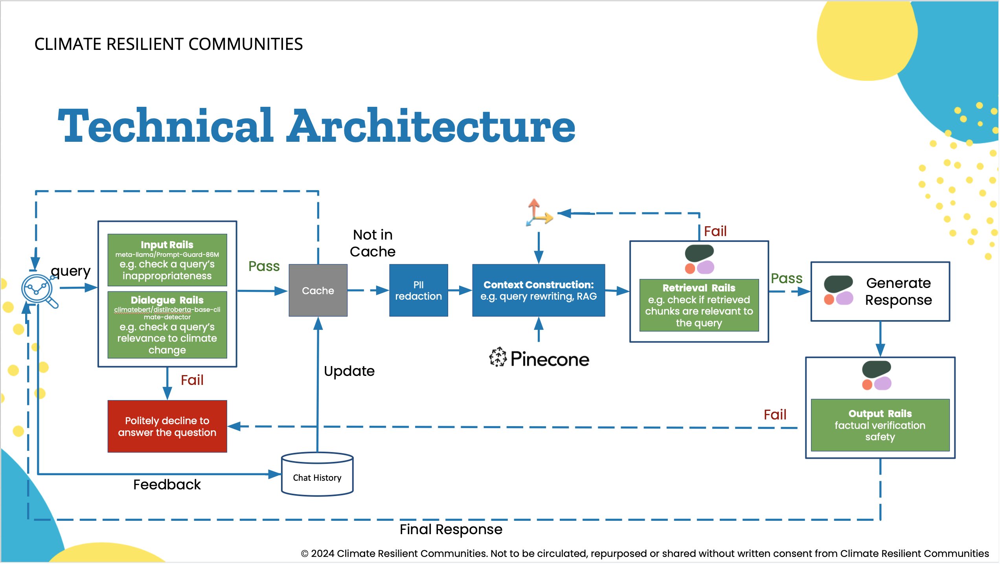
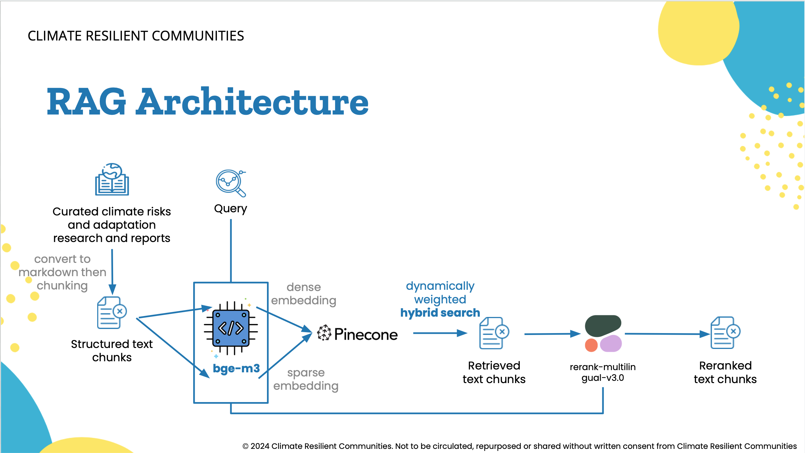
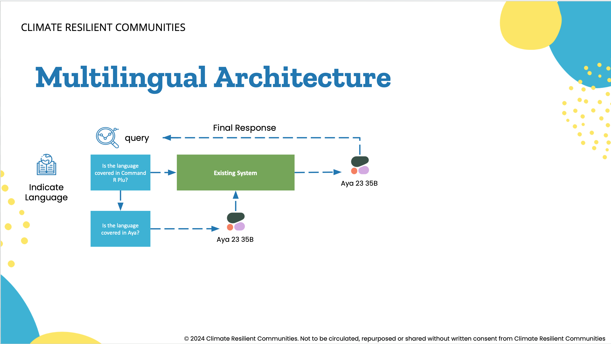

# Multilingual Climate Chatbot
## By Climate Resilient Communities 

Our Multilingual Climate Chatbot project aims to make climate research and education accessible to all Torontonians, regardless of their cultural or linguistic background. Many people lack understanding of climate risks and actions they can take, leading to limited engagement, high climate anxiety, and inequality in decision-making power, particularly among youth and marginalized communities. The existing climate information is disjointed and jargon-filled, and often excludes non-English speakers and marginalized communities. 

By offering timely, accurate, and easy-to-understand information on local climate risks, adaptation strategies, and best practices, the chatbot helps individuals and communities better understand how to mitigate, prepare for, and respond to climate impacts. It empowers individuals and communities to engage more effectively with climate risks, fostering increased inclusivity, climate literacy, and community action. 

## Architecture

## License
MIT

